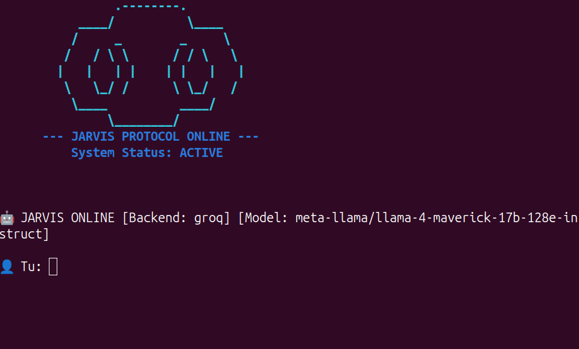

# 👁️ ARGOS: Autonomous Multimodal AI Agent for Linux


**ARGOS** (Autonomous Remote Grid Operating System) is a high-performance, multimodal AI agent capable of perceiving the desktop environment and executing complex workflows autonomously. By bridging the gap between Vision-Language Models (VLM) and low-level system automation, ARGOS can "see" the screen and "act" on any GUI application just like a human operator.

---

## 🚀 Full Feature Set

### 1. 👁️ Advanced Computer Vision
*   **Visual Grounding:** Identifies UI elements (buttons, search bars, icons) from raw pixels.
*   **Dynamic Grid Overlay:** A custom pre-processing pipeline that draws a high-contrast coordinate grid over screenshots, eliminating LLM spatial hallucinations and ensuring **pixel-perfect clicking**.
*   **Screen Description:** Provides semantic analysis of the current workspace, identifying open windows and active tasks.

### 2. 🖱️ OS & GUI Automation
*   **Intelligent Click Engine:** Supports single, double, and right-clicks with human-like mouse easing.
*   **Precision Typing:** Types text into specific UI fields. It automatically handles window focus using `xdotool` to ensure input reaches the correct application.
*   **Window Management:** Detects, launches, and brings specific applications (Firefox, Chrome, VS Code, etc.) to the foreground.
*   **System Telemetry:** Real-time monitoring of CPU and RAM usage.

### 3. 📂 File System Intelligence
*   **Full CRUD Operations:** Create, read, modify, rename, and delete files.
*   **Directory Management:** Automated creation and recursive deletion of directories.
*   **Context-Aware Navigation:** Resolves paths dynamically between Linux home and desktop environments.

### 4. 🌐 Web & Information Retrieval
*   **Autonomous Web Search:** Uses DuckDuckGo to browse the internet, synthesize information, and answer complex queries.
*   **Real-time Crypto Tracking:** Live price fetching for any cryptocurrency via API.

### 5. 🗣️ Multimodal Interface
*   **Voice Command Support:** Integrated Speech-to-Text (STT) for hands-free operation.
*   **Neural Speech Synthesis:** Text-to-Speech (TTS) output via gTTS for natural feedback.

### 6. 🛡️ Security & Safety
*   **Human-in-the-Loop (HITL):** A robust "Security Gate" that intercepts dangerous operations (file deletions, automated typing, app launching) and requires manual user approval.
*   **Chain of Thought Transparency:** Logs the agent's reasoning process in the terminal.

---

---

## 🖥️ System Interface

When initialized, **Argos** performs a full system diagnostic and protocol check. The interface is designed to provide clear feedback on the active LLM backend, model status, and environmental context.


*Figure 1: Argos Initialization Sequence featuring the Arc Reactor ASCII banner and system diagnostic logs.*

---

## 🧠 Technical Architecture

The agent operates on a **ReAct (Reasoning + Acting)** loop:

1.  **Observe:** Captures the environment state (Screenshot + File Context).
2.  **Reason:** The LLM (Llama 3/4 via Groq or Ollama) processes the history and visual grid to determine the next step.
3.  **Act:** The agent selects a tool (JSON format) and executes the corresponding Python logic.
4.  **Observe:** The output of the tool (success/error) is fed back to the LLM for the next iteration.

---

## 🧩 The "Grid-Mapping" Innovation

The biggest challenge with VLMs is **spatial inaccuracy**. To solve this, ARGOS implements a **Visual Grid Overlay**:
*   Instead of asking the AI to guess coordinates, the system draws a **Bright Green Grid** with numerical labels on the image.
*   The AI reads these labels to pinpoint targets.
*   The system then mathematically maps these relative points back to the absolute screen resolution.
*   **Result:** A massive increase in UI interaction reliability.

---

## 🛠️ Tech Stack

*   **Language:** Python 3.10+
*   **Models:** Meta Llama 3 (Reasoning), Llama 3.2 Vision / Llava (Vision)
*   **Inference:** Groq API (Cloud) & Ollama (Local)
*   **Automation:** PyAutoGUI, Xdotool, Subprocess
*   **Image Processing:** Pillow (PIL)
*   **Audio:** gTTS, SpeechRecognition, mpg123

---

## 📦 Installation & Setup

### 1. Install System Dependencies (Debian/Ubuntu)
```bash
sudo apt-get update
sudo apt-get install mpg123 scrot xdotool wmctrl python3-tk fonts-dejavu-core
```

### 2. Setup Environment
```bash
git clone https://github.com/yourusername/argos-ai-agent.git
cd argos-ai-agent
python3 -m venv venv
source venv/bin/activate
pip install -r requirements.txt
```

### 3. Configure API Keys
Create a `.env` file:
```env
GROQ_API_KEY=your_groq_api_key_here
LLM_BACKEND=groq
ENABLE_VOICE=True
```

---

## 🤝 Contact & Networking

I am a **Software Engineer** specializing in **AI Agents, Automation, and Python Development**.

*   **LinkedIn:** [[Your LinkedIn Profile Link](https://www.linkedin.com/in/alessandro-catania-3b35a83a6/)]
*   **GitHub:** [[Your GitHub Profile Link](https://github.com/AlexThunder01)]

---

## 📄 License
This project is licensed under the MIT License.