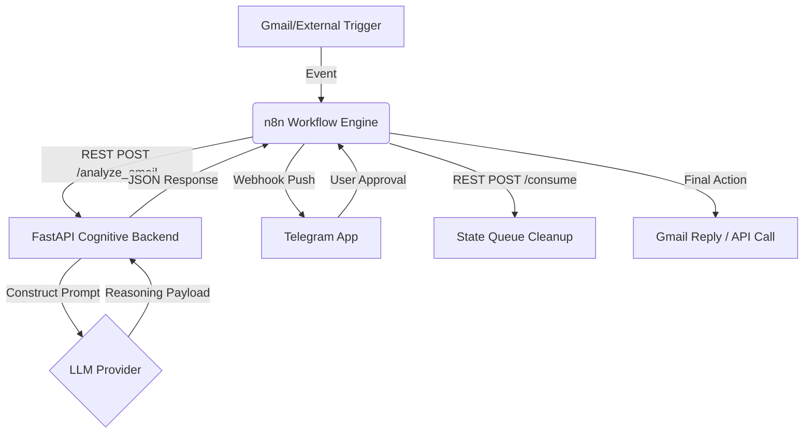

# ARGOS-2 Architecture: The Brain-Body Split

ARGOS-2 is built on a **decoupled, event-driven architecture** that separates deterministic workflow orchestration from probabilistic AI reasoning.

## 🏗️ The High-Level Flow

---

## 1. The Nervous System: n8n Workflow Engine
The "Body" of ARGOS. n8n handles all I/O, secret management for third-party services, and the visual orchestration of the Human-In-The-Loop (HITL) flow.
- **Trigger Layer**: Polls Gmail or listens for incoming webhooks (Telegram).
- **Control Layer**: Manages the logic of "If user clicked ✅ then do X, if ❌ then do Y".
- **Integration Layer**: Uses native nodes to authenticate with Google, Telegram, Slack, etc.

## 2. The Brain: FastAPI Cognitive Backend
The "Reasoning" center. Written in Python 3.12, it provides the intelligence that n8n lacks.
- **LLM Gateway**: Dynamically builds complex system prompts using the `config.yaml` parameters before querying the LLM (Cloud/Local).
- **Persistent State Queue**: To prevent race conditions during concurrent Telegram interactions, FastAPI relies on an atomic SQLite database in WAL Mode (bound to `workers=1`). This allows n8n to retrieve the exact context (Drafts, Thread IDs) sequentially just by passing a `messageId` to the `POST /consume` endpoint.
- **Tool Execution**: When the agent needs to "do" something (like OCR a PDF or search the web), it executes local Python tools within this backend.

## 3. The Communication Bridge: REST API
All communication between n8n and the Backend is done via standard HTTP/REST.
- **Security**: Every request from n8n to Python must include a valid `X-ARGOS-API-KEY`.
- **Networking**: In Docker, they communicate via an internal network (`argos-network`), keeping the API hidden from the public internet. Only the n8n Webhook port is exposed via the Ngrok tunnel.

---

## 🔒 Security Model

### Non-Root Execution
All containers are configured to run as a restricted user (`argos`), preventing potential container escape vulnerabilities from accessing the host filesystem.

### Token Sanitization
Draft responses and summaries are sanitized before being pushed to Telegram to ensure that no internal system prompts or raw API keys are leaked in the UI.

### Internal Isolation
The FastAPI backend (`argos-api`) does not have its own public IP or port exposure to the host. It is "shielded" by the n8n container, which acts as the only gateway to the outside world through the secure tunnel.
