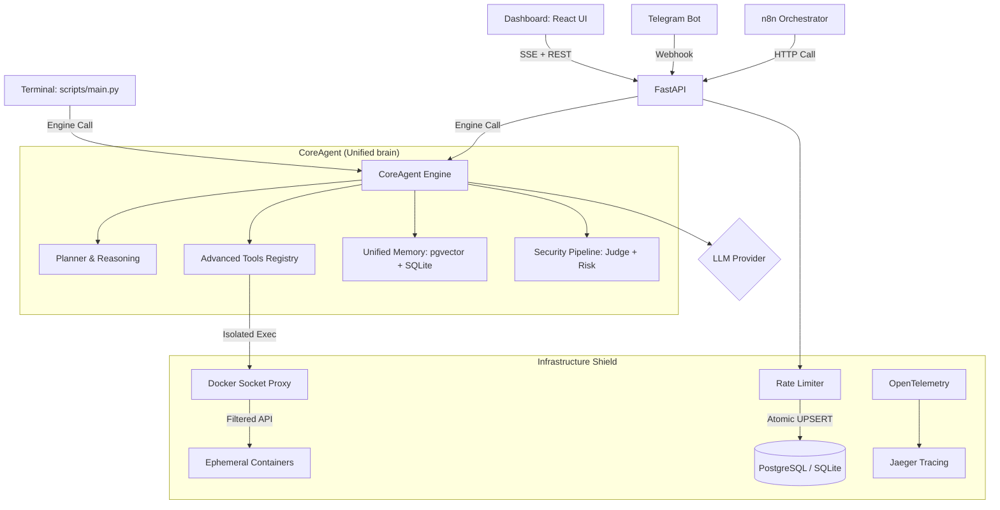

# ARGOS-2 Architecture: The CoreAgent Strategy

ARGOS-2 is built on a **Decoupled Unified Architecture** that separates the **Body** (Orchestration & Workflow) from the **Brain** (Cognitive Engine & Tools) and the **Shield** (Security & Infrastructure).

---

## 🏗️ The Unified Brain (One Architecture, Three Interfaces)

Unlike version 1.0, which handled CLI and API logic separately, ARGOS-2 introduces the `CoreAgent` engine (`src/core/`).

---

## 🏗️ Architectural Components

### 1. The Body: n8n Workflow Engine
The "Nervous System" of ARGOS. n8n handles all I/O, secret management, and deterministic visual orchestration.
- **Trigger Layer**: Listeners for incoming Gmail or Telegram webhooks.
- **Routing**: Decisions like "If user clicks approve, trigger Gmail reply."
- **Integrations**: Direct OAuth2 connections to third-party services.

### 2. The Command Center: Web Dashboard
A **React (Vite)** web interface served by FastAPI, featuring:
- **SSE Chat Terminal**: Real-time streaming responses from the CoreAgent via `EventSource`.
- **Docker Monitor**: Live CPU/MEM stats for all running containers (polled via `asyncio.to_thread`).
- **Rate Limit Widget**: Visual progress bars showing API quota consumption.
- **Glassmorphism UI**: Dark charcoal + neon cyan design with CSS Modules.

### 3. The CLI Interface
The "Local Direct Control" of ARGOS.
- **Direct Engine Access**: Calls `CoreAgent` directly without going through n8n.
- **Stateless vs. Persistent**: Can operate with ephemeral RAM memory or sync with the shared RAG database used by Telegram.
- **Security Gate**: Interactive `(y/N)` confirmation for dangerous tool execution.

### 4. The Brain: CoreAgent Engine
The "Reasoning" center. Located in `src/core/`, it provides the intelligence for all interfaces.
- **Unified Logic**: One shared reasoning loop for planning and tool execution.
- **Advanced Tools**: A modular registry of 23 tools (Code exec, Scrapers, Document parsers).
- **Security Middleware**: Global "Paranoid Judge" that intercepts and validates inputs before they reach the engine.
- **Memory Promotion**: RAG logic (embeddings, cosine similarity, extraction) is now a core capability available to both API and CLI.

### 5. The Data Layer
- **PostgreSQL 17 + pgvector**: Production vector database for RAG memory and similarity search.
- **SQLite WAL**: Lightweight local fallback for development and testing.
- **Connection Pooling**: `psycopg_pool` for efficient concurrent PostgreSQL access.

---

## 🔒 Security Hierarchy (5 Layers)

### Layer 1: Paranoid Judge (API Only)
A FastAPI middleware that uses a secondary LLM to judge the safety of incoming requests before any logic is processed. Controlled by `ARGOS_PARANOID_MODE`.

### Layer 2: Atomic Rate Limiting (Global)
Database-native sliding window quotas using `INSERT ... ON CONFLICT DO UPDATE`. Prevents API abuse without adding Redis as a dependency. Expired windows are cleaned up inline.

### Layer 3: Risk Scoring (Global)
A heuristic-based evaluation (regex + structural patterns) that assigns a risk score to any input or fact being saved to memory.

### Layer 4: Docker Sandbox Isolation
Code execution tools (`python_repl`, `bash_exec`) run in ephemeral Docker containers with:
- **No network access** (`network_mode: none`)
- **128MB RAM limit** (OOMKill on breach)
- **25% CPU quota**
- Accessible only through `tecnativa/docker-socket-proxy` (filtered API — no exec, no volumes, no networks)

### Layer 5: Security Gate (CLI Only)
Interactive manual authorization for powerful tools like `bash_exec`, `python_repl`, or `delete_file`.

### Layer 6: Non-Root Isolation
Docker containers run as a restricted `argos` user to prevent host-level system escapes.

---

## 🐳 Docker Compose Stack

| Service | Image | Purpose |
|:--------|:------|:--------|
| `argos-api` | Custom (Dockerfile) | FastAPI + CoreAgent + Dashboard |
| `argos-db` | `pgvector/pgvector:pg17` | PostgreSQL + vector extensions |
| `n8n` | `n8nio/n8n` | Workflow orchestration |
| `ngrok` | `ngrok/ngrok` | Webhook tunneling |
| `argos-jaeger` | `jaegertracing/jaeger:2.17.0` | Distributed tracing |
| `argos-docker-proxy` | `tecnativa/docker-socket-proxy` | Secure Docker API filter |
