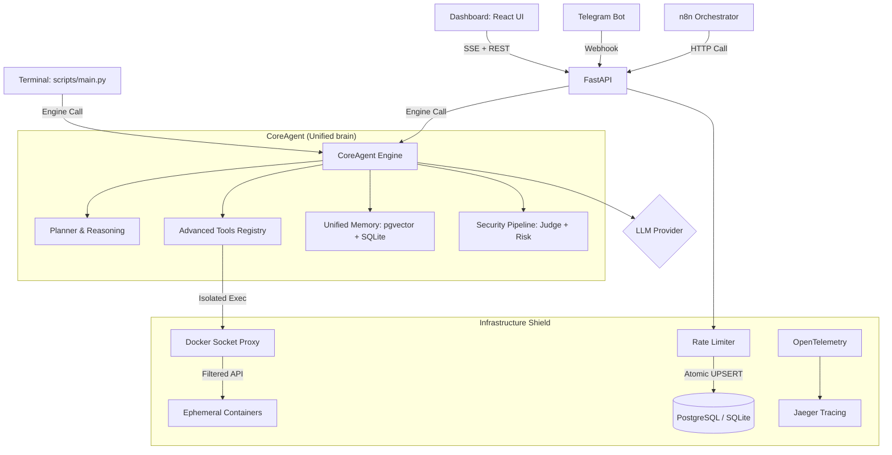

# ARGOS-2 Architecture: The CoreAgent Strategy

ARGOS-2 is built on a **Decoupled Unified Architecture** that separates the **Body** (Orchestration & Workflow) from the **Brain** (Cognitive Engine & Tools) and the **Shield** (Security & Infrastructure).

---

## 🏗️ The Unified Brain (One Architecture, Three Interfaces)

Unlike version 1.0, which handled CLI and API logic separately, ARGOS-2 introduces the `CoreAgent` engine (`src/core/`).

---

## 🏗️ Architectural Components

### 1. The Body: n8n Workflow Engine
The "Nervous System" of ARGOS. n8n handles all I/O, secret management, and deterministic visual orchestration.
- **Trigger Layer**: Listeners for incoming Gmail or Telegram webhooks.
- **Routing**: Decisions like "If user clicks approve, trigger Gmail reply."
- **Integrations**: Direct OAuth2 connections to third-party services.

### 2. The Command Center: Web Dashboard
A **React (Vite 8)** web interface served by FastAPI, featuring:
- **SSE Chat Terminal**: Real-time streaming responses from the CoreAgent via `EventSource`.
- **Docker Monitor**: Live status for all running containers (polled via `asyncio.to_thread`).
- **Resource Telemetry**: Live **CPU**, **RAM**, and **DB Pool** tracking via `psutil` integration in Python.
- **Security Audit Logging**: Visualizes risk average scores and blocked count today by querying `tg_suspicious_memories` directly in PostgreSQL.
- **Latency Monitoring**: Continuous micro-benchmarking of API-to-DB and Network roundtrips.
- **Glassmorphism UI**: Dark charcoal + neon cyan design with CSS Modules.

### 3. The CLI Interface
The "Local Direct Control" of ARGOS.
- **Direct Engine Access**: Calls `CoreAgent` directly without going through n8n.
- **Stateless vs. Persistent**: Can operate with ephemeral RAM memory or sync with the shared RAG database used by Telegram.
- **Security Gate**: Interactive `(y/N)` confirmation for dangerous tool execution.

### 4. The Brain: CoreAgent Engine
The "Reasoning" center. Located in `src/core/`, it provides the intelligence for all interfaces.
- **Unified Logic**: One shared reasoning loop for planning and tool execution.
- **Advanced Tools**: A modular registry of 33 tools (Code exec, Browser, Scrapers, Document parsers, Finance, plus `search_tools` for runtime tool discovery).
- **Security Middleware**: Global "Paranoid Judge" that intercepts and validates inputs before they reach the engine.
- **Memory Promotion**: RAG logic (embeddings, cosine similarity, extraction) is now a core capability available to both API and CLI.

### 5. Context Management Pipeline

Located in `src/agent.py` and `src/core/`, the context pipeline keeps the conversation within the token budget across long multi-tool tasks.

**Three-tier compaction** (called inside `ArgosAgent.trim_history()`):

1. **Tier 1 — Micro-compact** (>80 % budget, no LLM call): clears the content of old tool results, WorldState snapshots, and raw JSON tool calls, keeping only the `MICRO_COMPACT_KEEP_RECENT` (default 5) most recent. Message count unchanged, only stale content replaced with `"[cleared]"`.
2. **Tier 2 — Structured compaction** (>90 % budget, opt-in via `ARGOS_ENABLE_COMPACTION=1`, ≥5 messages): calls the lightweight model to produce a 9-section structured summary. The entire history is replaced with 3 messages: system + summary + ack. Falls back transparently on any error.
3. **Tier 3 — Drop** (>100 % budget): drops oldest non-system messages until budget fits. Original behaviour, always present as last resort.

**Time-based micro-compact**: if `ARGOS_MC_TTL_MINUTES` (default 60) of idle time elapse since the last LLM call, `_check_time_based_mc()` fires micro-compact pre-emptively before the next call — the server-side prompt cache has expired so there is nothing to lose.

**Session working memory** (`src/core/session_memory.py`): after every `ARGOS_SESSION_MEMORY_UPDATE_EVERY` (default 5) tool calls, an `asyncio.create_task` + `to_thread` background write updates `.argos_session_memory.md` with a lightweight-model summary of the current task state. The file is injected into the LLM context at the start of the next task, bridging context across consecutive sessions without blocking the reasoning loop.

**Tool RAG** (`ToolRegistry.select_for_query()`): at the start of each task, TF-IDF cosine similarity selects the top-12 most relevant tools from the full registry. The `search_tools` tool (always included) lets the model discover additional tools at runtime by issuing a `search_tools` call with a natural language query.

**`<analysis>` scratchpad** (`src/planner/planner.py`): the planner schema allows the model to prepend `<analysis>...</analysis>` to its output for private chain-of-thought. It is stripped by `_ANALYSIS_RE` before any JSON parsing and never surfaces to the user.

**Post-compact cleanup**: when Tier 2 fires, the engine detects the `_compact_count` increment on `ArgosAgent` and immediately resets `_git_context_cache` and clears the session memory file so stale cached state does not pollute the compacted history.

**Activity summary**: an `asyncio.Task` running in the background of `_reasoning_loop` logs `[ActivitySummary] [step N/max] <task>` every 30 seconds via `logger.info`. An optional `status_callback` on `CoreAgent` can forward these messages to any consumer (SSE, Telegram, etc.).

### 7. The Data Layer
- **PostgreSQL 17 + pgvector**: Production vector database for RAG memory and similarity search.
- **SQLite WAL**: Lightweight local fallback for development and testing.
- **Connection Pooling**: `psycopg_pool` for efficient concurrent PostgreSQL access.

---

## 🔒 Security Hierarchy (5 Layers)

### Layer 1: Paranoid Judge (API Only)
A FastAPI middleware that uses a secondary LLM to judge the safety of incoming requests before any logic is processed. Controlled by `ARGOS_PARANOID_MODE`.

### Layer 2: Atomic Rate Limiting (Global)
Database-native sliding window quotas using `INSERT ... ON CONFLICT DO UPDATE`. Prevents API abuse without adding Redis as a dependency. Expired windows are cleaned up inline.

### Layer 3: Risk Scoring (Global)
A heuristic-based evaluation (regex + structural patterns) that assigns a risk score to any input or fact being saved to memory.

### Layer 4: Docker Sandbox Isolation
Code execution tools (`python_repl`, `bash_exec`) run in ephemeral Docker containers with:
- **No network access** (`network_mode: none`)
- **128MB RAM limit** (OOMKill on breach)
- **25% CPU quota**
- **Read-only workspace** mount (container can read input files but not write to host)
- Accessible only through `tecnativa/docker-socket-proxy` (filtered API — no exec)

### Layer 5: Security Gate (CLI Only)
Interactive manual authorization for tools with `risk` level of `medium`, `high`, or `critical` via a pluggable confirmation callback.

### Layer 6: Non-Root Isolation
The API container creates a restricted `argos` user (`groupadd -r argos && useradd -r -g argos`) and runs all processes as that user via `USER argos` in the Dockerfile.

### Layer 7: Circuit Breaker
API routes use `pybreaker.CircuitBreaker(fail_max=3, reset_timeout=60)` on LLM calls. After 3 consecutive failures, the circuit opens and immediately returns an error for 60 seconds, preventing thread pool saturation.

---

## 🐳 Docker Compose Stack

| Service | Image | Purpose |
|:--------|:------|:--------|
| `argos-api` | Custom (Dockerfile) | FastAPI + CoreAgent + Dashboard |
| `argos-db` | `pgvector/pgvector:pg17` | PostgreSQL + vector extensions |
| `n8n` | `n8nio/n8n` | Workflow orchestration |
| `ngrok` | `ngrok/ngrok` | Webhook tunneling |
| `argos-jaeger` | `jaegertracing/jaeger:2.17.0` | Distributed tracing |
| `argos-docker-proxy` | `tecnativa/docker-socket-proxy` | Secure Docker API filter |
