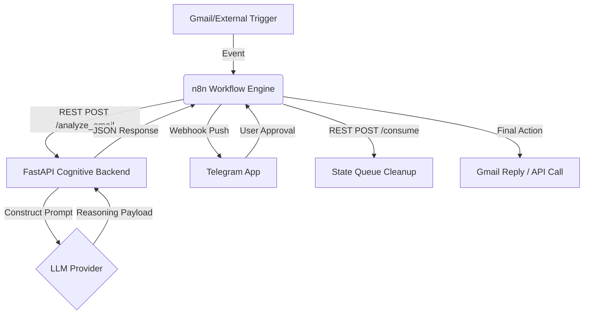

# ARGOS-2 Architecture: The Brain-Body Split

ARGOS-2 is built on a **decoupled, event-driven architecture** that separates deterministic workflow orchestration from probabilistic AI reasoning.

## 🏗️ The High-Level Flow

---

## 1. The Nervous System: n8n Workflow Engine
The "Body" of ARGOS. n8n handles all I/O, secret management for third-party services, and the visual orchestration of the Human-In-The-Loop (HITL) flow.
- **Trigger Layer**: Polls Gmail or listens for incoming webhooks (Telegram).
- **Control Layer**: Manages the logic of "If user clicked ✅ then do X, if ❌ then do Y".
- **Integration Layer**: Uses native nodes to authenticate with Google, Telegram, Slack, etc.

## 2. The Brain: FastAPI Cognitive Backend
The "Reasoning" center. Written in Python 3.12, it provides the intelligence that n8n lacks.
- **Modular Architecture**: The API is now organized into functional routes (`api/routes/`) for Agent logic, Email HITL, and Telegram management, ensuring maintainability and scalability.
- **LLM Gateway**: Dynamically builds complex system prompts using the `config.yaml` parameters before querying the LLM (Cloud/Local).
- **Asynchronous Execution**: Long-running LLM inferences are executed off-thread using `asyncio.to_thread` to prevent blocking the FastAPI event loop, ensuring responsive concurrent handling.
- **Persistent State Queue**: To prevent race conditions, FastAPI relies on an atomic SQLite database in WAL Mode. This allows n8n to retrieve the exact context (Drafts, Thread IDs) sequentially.
- **Tool Execution**: Executes local Python tools within this backend.

## 3. The Communication Bridge: REST API
All communication between n8n and the Backend is done via standard HTTP/REST.
- **Security**: Mandatory `X-ARGOS-API-KEY` validation. The server warns on startup if no key is configured to prevent unintentional public exposure.
- **Networking**: Internal Docker network (`argos-network`) isolation. Only n8n is exposed to the outside world.

---

## 🔒 Security Model

### Non-Root Execution
All containers are configured to run as a restricted user (`argos`), preventing potential container escape vulnerabilities from accessing the host filesystem.

### Token Sanitization
Draft responses and summaries are sanitized before being pushed to Telegram to ensure that no internal system prompts or raw API keys are leaked in the UI.

### Internal Isolation
The FastAPI backend (`argos-api`) does not have its own public IP or port exposure to the host. It is "shielded" by the n8n container, which acts as the only gateway to the outside world through the secure tunnel.
