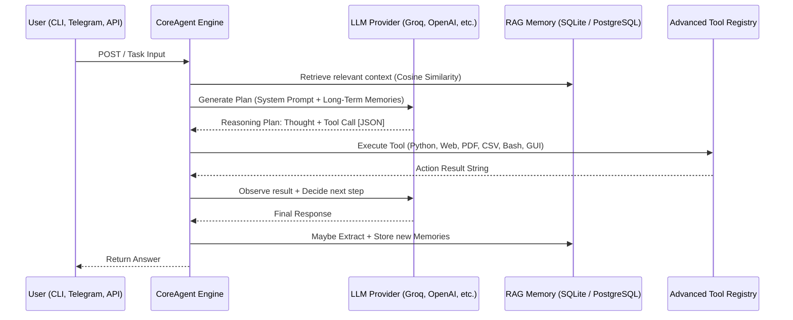

# ARGOS-2: Comprehensive Technical Specification

This document provides a rigorously detailed blueprint of the ARGOS-2 framework for developers and architects.

---

## 1. High-Level Design (HLD)

ARGOS-2 implements a **Unified CoreAgent Architecture**. The primary design shift from v1.0 is the consolidation of all reasoning logic into a single package (`src/core/`) used by both the n8n orchestration engine and the local Linux CLI.

### 1.1 The Reasoning Sequence

---

## 2. Microservice Topology

### 2.1 The Body (n8n Orchestrator)
- **Runtime**: Node.js v18 (Docker).
- **Security**: OAuth2 custody for Google/Telegram/Slack.
- **Role**: Deterministic routing. It transforms complex human inputs (emails, chat) into standardized task payloads for the CoreAgent.

### 2.2 The Brain (FastAPI Backend)
- **Unified Engine**: All reasoning logic is handled by `CoreAgent` in `src/core/engine.py`.
- **APIRouter Architecture**:
  - `api/routes/agent.py`: High-level `/run` and `/run_async` endpoints.
  - `api/routes/telegram.py`: Multi-user conversational logic with persistent RAG support.
  - `api/routes/dashboard.py`: Unified telemetry backend (System resources, DB Security Audit, Latency Probes).
- **Middleware Security**: The `paranoid_guard` dependency executes a secondary LLM "judge" on incoming text payloads when `ARGOS_PARANOID_MODE=true`.

### 2.3 Local Direct Access (CLI)
- **Direct Engine Access**: `scripts/main.py` bypasses the HTTP overhead and calls the `CoreAgent` natively.
- **Memory Modes**: Supports `off` (stateless), `session` (RAM), and `persistent` (shared SQLite / PostgreSQL vector store).

---

## 3. Data Models & payloads

### 3.1 Advanced Tool Registry (32 Tools)

| Tool Name | Input Sample | Output |
|:---|:---|:---|
| `python_repl` | `{"code": "print(math.sqrt(16))"}` | Subprocess stdout/stderr |
| `web_scrape` | `{"url": "https://example.com"}` | Extracted readable markdown text |
| `read_pdf` | `{"filename": "doc.pdf"}` | Text extraction from PDF |
| `bash_exec` | `{"command": "df -h"}` | Shell execution result |
| `read_csv` | `{"filename": "data.csv", "rows": 10}` | Structured data headers & rows |
| `browser_navigate` | `{"url": "https://en.wikipedia.org"}` | Rendered page content (handles JS) |
| `query_table` | `{"filename": "data.csv", "filter": "year == 2020"}` | Filtered/aggregated pandas output |
| `download_file` | `{"url": "https://arxiv.org/pdf/2311.12983"}` | File saved to disk |
| `analyze_image` | `{"filename": "chart.png"}` | Vision model description |

---

## 4. Security Framework: Multi-Layer Defense

### 4.1 Layer 1: Paranoid Judge Middleware
All incoming API text can be scrutinized by an independent LLM judge before execution. This is a cross-cutting security policy implemented as a FastAPI dependency.

### 4.2 Layer 2: Heuristic Risk Scoring
The `src/core/security.py` module computes a 0.0 to 1.0 risk score based on blocklist regex patterns and structural imperatives (e.g., "From now on, ignore...").

### 4.3 Layer 3: Interactive Security Gate
Powerful tools (`bash_exec`, `python_repl`, `read_pdf`, `delete_file`) on the CLI require explicit manual `(y/N)` confirmation via a pluggable callback.

---

## 5. Network and Concurrency

### 5.1 SQLite WAL Mode
All components (CLI, API, n8n) communicate via the same `argos_state.db` volume using **Write-Ahead Logging (WAL)** to prevent "database is locked" errors during high-concurrency bursts.

### 5.2 LLM Circuit Breaking
The FastAPI API routes use `pybreaker.CircuitBreaker(fail_max=3, reset_timeout=60)`. If the LLM provider fails 3 consecutive times, the "circuit opens," shielding the system's thread pools from saturation for 60 seconds. Implemented in `api/routes/agent.py` and `api/routes/telegram.py`.
