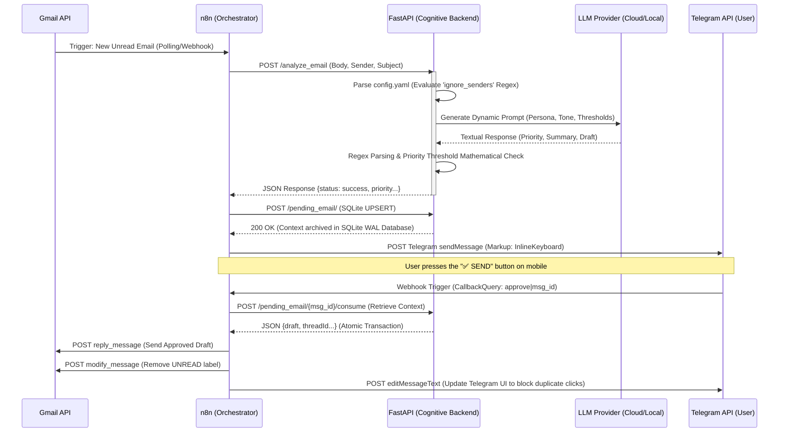

# ARGOS-2: Comprehensive Technical Specification

This document serves as the official **Technical Specification** for the ARGOS-2 framework. Its purpose is to provide DevOps Engineers, Cloud Architects, and Backend Developers with a rigorous and exhaustive blueprint of the system architecture, data models, and operational flows.

---

## 1. High-Level Design (HLD)
ARGOS-2 implements a **De-coupled Asynchronous Event-Driven Architecture**. The core design paradigm ("Brain-Body Split") isolates I/O orchestration from probabilistic reasoning via independent API-communicating containers.

### 1.1 Human-In-The-Loop (HITL) Sequence Diagram
The following Mermaid diagram outlines the exact HTTP timeline and lifecycle of an email, from ingestion to the final authorized response.



---

## 2. Microservice Definition (C4 Model: Container Layer)

### 2.1 Orchestrator Node (n8n v2.x)
- **Runtime**: Node.js v18+ (Official n8n Docker Container).
- **Responsibilities**:
  - Secure custody of OAuth2 credentials via an internal encrypted SQLite database.
  - Passive Webhook listener exposed on internal port `5678`.
  - Batch Execution Engine for for-each loops (e.g., N concurrent emails incoming).
- **Security Constraints**: The variables `N8N_EDITOR_BASE_URL` (localhost) and `WEBHOOK_URL` (public ngrok edge) must be explicitly disambiguated in `.env` to prevent "URI Mismatch" loops during Google GCP OAuth2 callback flows.

### 2.2 Cognitive Node (FastAPI Backend)
- **Runtime**: Python 3.12 Slim (Custom Container).
- **Stack**: FastAPI, Uvicorn (ASGI), PyYAML, Requests, PyBreaker.
- **Structure**: Modular `APIRouter` architecture:
  - `api/routes/agent.py`: Core autonomous task execution (`/run`).
  - `api/routes/email.py`: Email analysis and context management (`/analyze_email`).
  - `api/routes/telegram.py`: Conversational logic and RAG memory integration.
  - `api/routes/admin.py`: Administrative user and security monitoring.
- **Concurrency Model**: Utilizes `asyncio.to_thread` for LLM blocking I/O, allowing the single-worker Uvicorn process to handle concurrent requests without freezing the event loop.
- **Responsibilities**:
  - `POST /analyze_email`: Stateless endpoint that decodes n8n requests and queries the AI gateway.
  - `POST /pending_email` & `POST /pending_email/{id}/consume`: Stateful Context Management via SQLite (WAL mode).
- **Why a Parking State Backend?** In n8n, when a Telegram Webhook resumes a workflow, it loses access to upstream payloads. The ARGOS backend acts as a High-Speed Cache decoupler.

### 2.3 Network Layer and Tunneling
- Traffic between n8n and FastAPI traverses exclusively on the `argos-network` docker bridge network, physically isolated from the host machine's networking stack.
- Webhook ingestion (Telegram -> n8n) is routed through **Ngrok**, which establishes an encrypted L7 tunnel directed straight into port `5678` of the n8n container. This bypasses local NATs and firewalls without opening public physical ports.

---

## 3. Data Model Routing & Payload Structures

### 3.1 `POST /analyze_email`
**Request Payload (n8n -> FastAPI):**
```json
{
  "sender": "Alessandro Catania <catania.alex3@gmail.com>",
  "subject": "Urgent Meeting Request",
  "body": "Good morning, I need to schedule a call..."
}
```
**Response Payload (FastAPI -> n8n):**
Two possible response shapes depending on processing outcome:
*Suspended Case (Discarded by regex blacklist or Priority-Threshold setting):*
```json
{
  "status": "ignored",
  "reason": "priority_below_threshold (SPAM)"
}
```
*Successful Case (Processed by LLM):*
```json
{
  "status": "success",
  "priority": "high",
  "summary": "Alessandro Catania is requesting an urgent meeting...",
  "draft": "Dear Alessandro,\nthank you for reaching out. I am available..."
}
```

---

## 4. Security Policies and Privilege Escalation Mitigation

1. **Host-Filesystem Sandboxing**: The FastAPI image enforces a `USER argos` (UID 1000) directive.
2. **Key Rotation & Lifecycle**: The `X-ARGOS-API-KEY` is statically defined in `.env`. **Rotation Protocol**: Update the `.env` value and explicitly restart the containers using `docker compose restart`. Without a reverse-proxy gateway, this key inherently has global scope across all endpoints.
3. **Atomic State Execution**: The `POST /pending_email/{msgId}/consume` method extracts and simultaneously drops the row via a SQLite Atomic Transaction. This acts as a robust replay-attack mitigation: clicking "SEND" twice on Telegram will return `404 Not Found` on the second attempt.
4. **Prompt Injection Defense (Caveat)**: The system structurally fences user input inside explicit text blocks (`BODY: {req.body}`) and enforces output Schema Validation in Python (checking that the generated priority matches hardcoded enums). **Warning**: This does not offer 100% mathematical immunity against advanced adversarial jailbreaks (e.g., Unicode mask encoding). For highly sensitive enterprise data, an intermediate LLM Validation agent layer is necessary.

## 5. Network Resiliency & Known Bottlenecks (Enterprise Disclaimers)

### 5.1 Ngrok in Production
Ngrok is bundled for **Development and Quickstart Testing**. In a true Enterprise Production environment, Ngrok acts as a Single Point of Failure (SPOF) and may intercept traffic, raising GDPR/Compliance issues.
* **Production Recommendation**: Replace the Ngrok container with an authenticated Reverse Proxy (e.g., **Traefik** or **Caddy**), exposing a dedicated Webhook subdomain backed by Let's Encrypt TLS certs.

### 5.2 SQLite Concurrency & Scaling
The persistent state is managed via an `argos_state.db` SQLite volume operating in **WAL (Write-Ahead-Log) Mode**.
To guarantee thread safety without triggering `database is locked` OperationalErrors during massive bursts of I/O, the Uvicorn ASGI server is strictly bound to `--workers 1`. For multi-pod horizontal scaling (Kubernetes), SQLite must be swapped for Redis.

### 5.3 LLM Rate-Limiting & Circuit Breaking
IMAP workflows are highly *bursty*. To prevent LLM provider rate-limiter saturation (`429 Too Many Requests`), the FastAPI backend protects LLM inference via the **`pybreaker` Circuit Breaker** pattern. If the LLM provider fails 3 consecutive times, the Circuit opens and immediately fails-fast incoming requests for 60 seconds protecting Uvicorn's thread pools.
